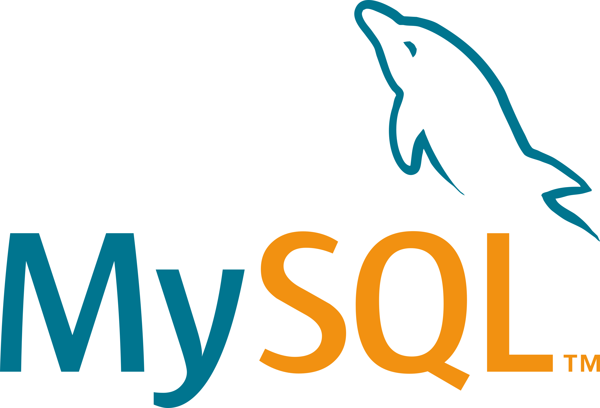
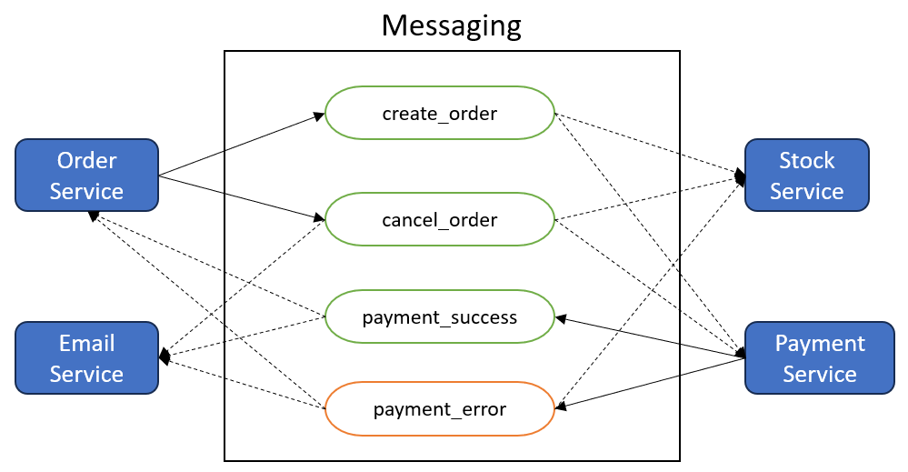

# Dotnet Choreographed Saga

This project was developed to test the implementation of the Saga pattern in dotnet with choreographed mode

## Resources used

- DotNet 7
- EF Core
- API
- Console App
- MySQL
- RabbitMQ
- Pub/Sub
- Micro Services

<div style="display: flex; align-items: center; gap: 45px; margin: 30px 0 0 40px;">
  
  
  
</div>

## What is SAGA pattern?

The Saga Pattern is a design pattern used in distributed systems to manage long-running and complex transactions without relying on a central coordinator. It breaks down a transaction into a series of smaller, independent, and reversible steps called sagas.

Each saga represents a unit of work that can be individually executed and compensated if needed. If an error occurs in any step, the corresponding compensating transactions are executed to rollback or undo the changes made by previous steps.

This approach ensures better fault tolerance and scalability in distributed systems, allowing for more resilient and flexible transaction management across microservices or distributed components.

## Saga message flow

<p align="center">
  
</p>

## Example of requests

```json
{
  "discountValue": 60,
  "requesterName": "Guilherme",
  "requesterEmail": "guilherme@email.com",
  "products": [
    {
      "productId": "b584159e-eeac-4586-bd76-557249d61daf",
      "value": 4399,
      "amount": 1
    }
  ]
}
```

```json
{
  "discountValue": 60,
  "requesterName": "Guilherme",
  "requesterEmail": "guilherme@email.com",
  "products": [
    {
      "productId": "b584159e-eeac-4586-bd76-557249d61daf",
      "value": 4399,
      "amount": 1
    },
    {
      "productId": "5f36da7e-7c77-4ea5-b65f-1bf3744fdc78",
      "value": 2199,
      "amount": 1
    }
  ]
}
```

## Test

To run this project you need docker installed on your machine, see the docker documentation [here](https://www.docker.com/).

Having all the resources installed, run the command in a terminal from the root folder of the project and wait some seconds to build project image and download the resources: `docker-compose up -d`

In terminal show this:

```console
[+] Running 8/8
 ✔ Network dotnet-choreographed-saga_app_network  Created                      1.2s
 ✔ Volume "dotnet-choreographed-saga_my-db"       Created                      0.0s
 ✔ Container rabbitmq                             Started                      2.5s
 ✔ Container orderdb                              Started                      1.5s
 ✔ Container payment_service                      Started                      5.2s
 ✔ Container email_service                        Started                      5.0s
 ✔ Container stock_api                            Started                      6.8s
 ✔ Container order_api                            Started                      6.3s
```

After this, access the link below:

- Swagger OrderAPI [click here](http://localhost:5000/swagger)
- Swagger StockAPI [click here](http://localhost:5001/swagger)

### Stop Application

To stop, run: `docker-compose down`
